## 按键

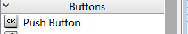

### 设置颜色

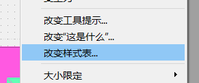

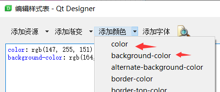


## 数字LCD


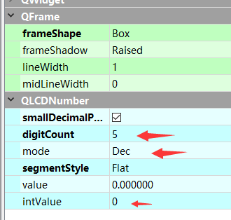

设置  个数  进制  样式  值

### 修改颜色

同按键的颜色设置


## 单行文字

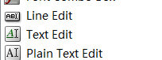

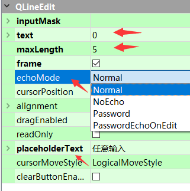

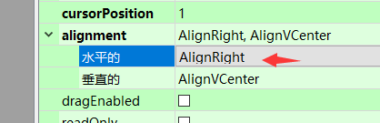

设置 数据 长度 模式 提示 对齐

### 其他设置

在Frame中的 的按钮无法控制大小 可以在下面更改

设置固定的 然后固定最大与最小大小

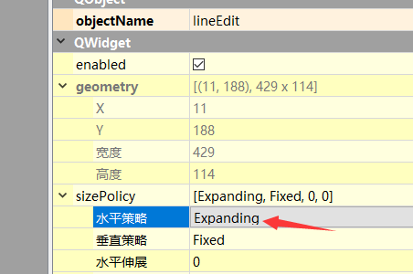


字体大小

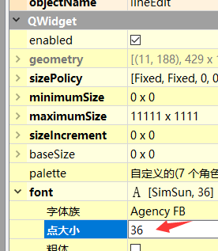

字体方向

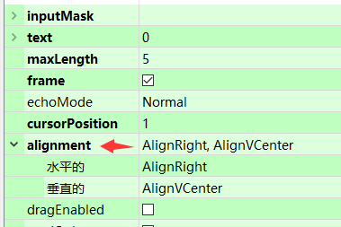


## Tab Widget

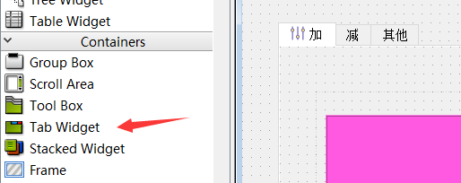


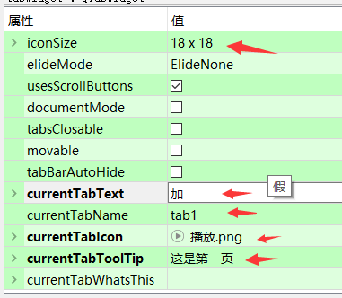

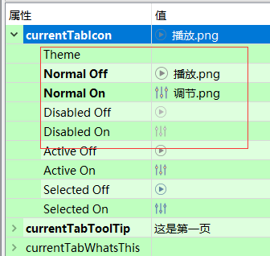

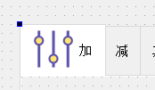

这个设置比较简单 就是icon设置好看点就行  图标的大小会影响整个页面选择的大小

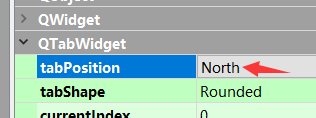

这里是更换页面标签显示的位置 下面那个是样式

### 简单使用

Tab Widget内部的小控件 是通过名字访问的

获取当前页面与判断

```python
self.tabWidget.currentChanged.connect(self.Tab_Call)
if self.tabWidget.currentIndex() == 0:
```


## 添加资源文件

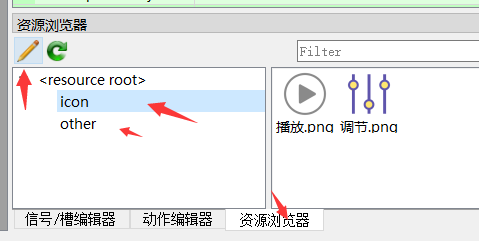

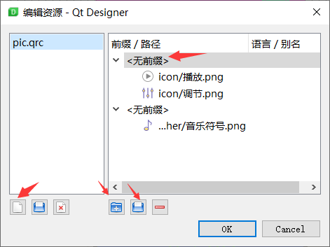

全部新建即可 然后加入 png图片  前缀设置无 

[阿里巴巴矢量图标库](https://www.iconfont.cn/)  可GitHub登录

### 转换

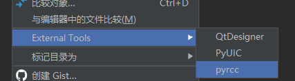


### 文件分层

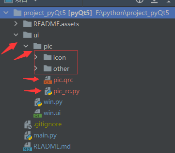

### 修改 win.ui 转换后的文件

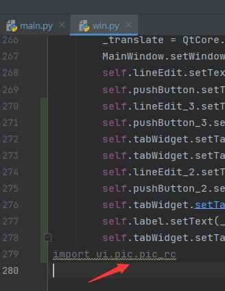


## 制作记事本

### 文件与目录操作

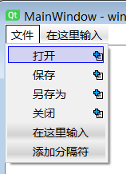

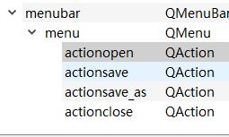

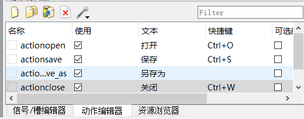


### 代码处理

```
path = QFileDialog.getOpenFileName(self, "请选择文件")[0]  # 返回的是一个元组数据，第一个成员是文件名

path = QFileDialog.getExistingDirectory(self,"请选择目录","") #  返回当前目录

```


### 重写父类

```
# 重写父类 关闭
def closeEvent(self, e) -> None:
```

判断文件是否修改与弹窗

```
if self.textEdit.document().isModified():

answer = QMessageBox.question(self, "请检查文件", "文件未保存,请确认", QMessageBox.Save | QMessageBox.Discard | QMessageBox.Cancel)

```


## 串口制作

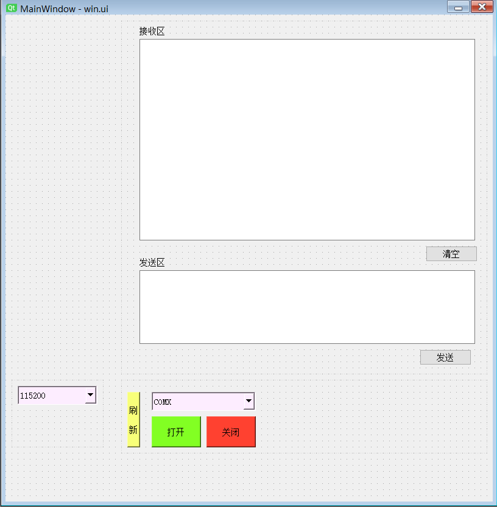

### 配置保存与读取

```python
from PyQt5.QtCore import QSettings

        # 配置文件
        self.settings = QSettings("config.ini", QSettings.IniFormat)

        # 获取
        self.com = self.settings.value("SETUP/COM_VALUE")
        self.baud = self.settings.value("SETUP/BAUD_VALUE")

        # 设置
        if self.baud is None:
            self.baud = 9600
            self.settings.setValue("SETUP/BAUD_VALUE", self.baud)  # 保存
```


### 下拉框

```python
self.baud = self.comboBox_baud.currentText()
self.comboBox_baud.setCurrentText(self.baud)
```

### 串口类的使用

```python
from PyQt5.QtSerialPort import QSerialPort, QSerialPortInfo

        # 串口类
        self.com = QSerialPort()
```


#### 获取所有串口

```python
def button_refresh_cb(self):
    com_list = QSerialPortInfo.availablePorts()  # 获取所有的端口信息
    for com in com_list:
        print(com.portName())  # 返回串口号，如COM1
        print(com.description())  # 返回设备硬件描述 如USB-SERIAL CH340
        print(com.productIdentifier())  # 返回设备编号 如29987
        print(com.standardBaudRates())  # 返回设备的支持波特率列表
```

#### 打开/关闭串口

```python
self.com.setPortName(port)  # 使用名字 绑定COM口
if self.com.open(QSerialPort.ReadWrite) == False:  # QSerialPort  QIODevice  打开端口
    print("open err")
    QMessageBox.critical(self, '严重错误', '串口打开失败')
    self.com.close()
    return

if self.com.isOpen():
    print("is open")
```


#### 设置串口参数

```python
self.com.setBaudRate(int(self.baud))  # 波特率
self.com.setDataBits(self.com.Data8)  # 8
self.com.setParity(self.com.NoParity)  # n
self.com.setStopBits(self.com.OneStop)  # 1
self.com.setFlowControl(self.com.NoFlowControl)
```


#### 读写数据

```
self.com.write(txData.encode('UTF-8'))
rxData = bytes(self.com.readAll())
```

#### 

